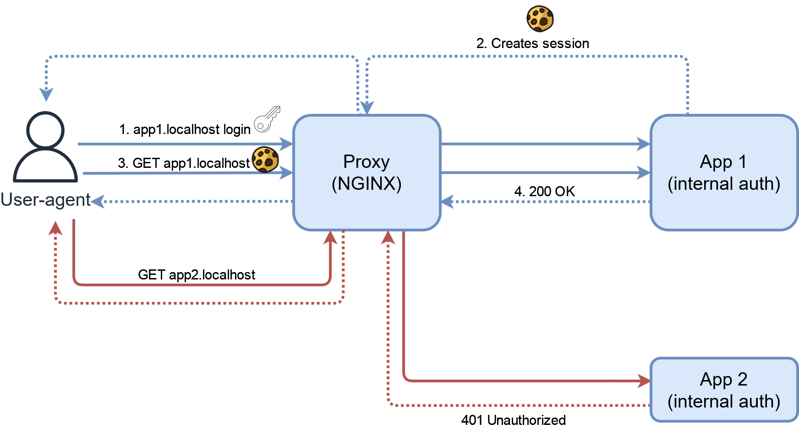
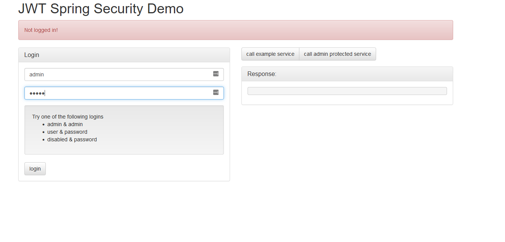

# Internal authentication



This schema represents the concept and not the exact architcture in the code.
## Run

```
docker-compose up
```

## Usage

The following apps are available:

* http://app1.localhost
    * Authentication required in the app
    * Superuser can be created on first use
* http://app2.localhost
    * Authentication required in the app
    * Credentials: admin/admin

## Screenshots


