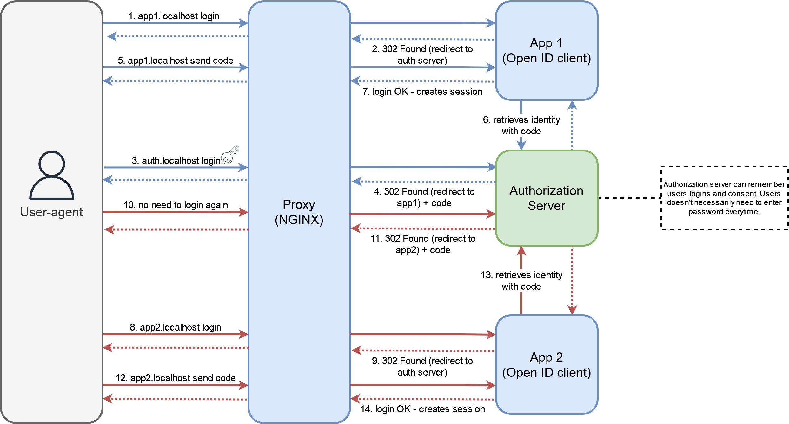
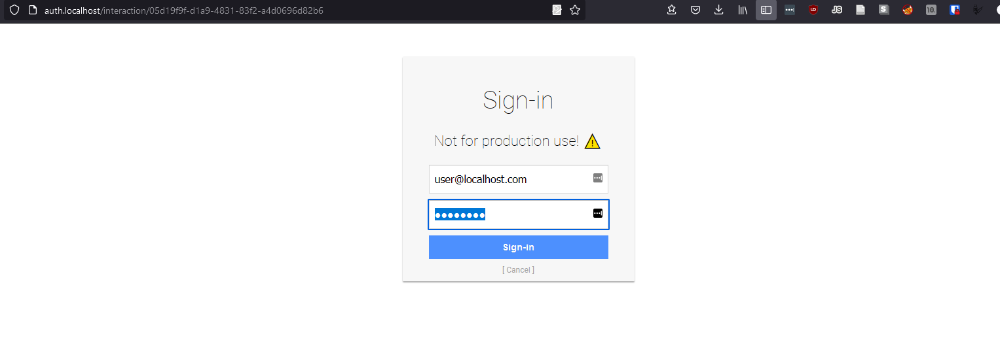
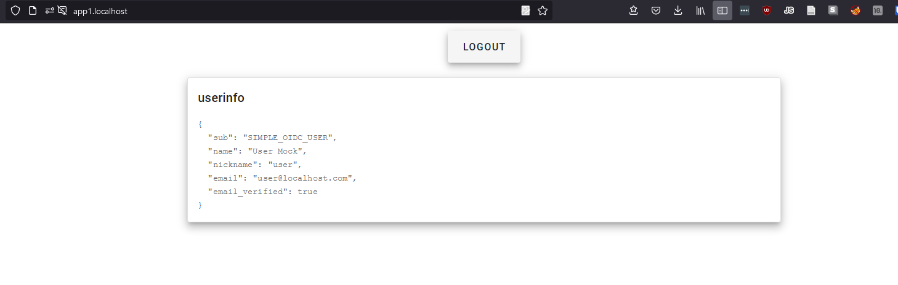

# OpenID Connect Authentication



This schema represents the concept and not the exact architcture in the code.
## Run

```
docker-compose up
```

## Usage

The following apps are available:

* http://app1.localhost
    * OpenID Connect Authentication
* http://app2.localhost
    * OpenID Connect Authentication
* http://auth.localhost
    * OpenID Connect authorization server
    * Discovery URL: http://auth.localhost/.well-known/openid-configuration
    * Credentials: user@localhost.com/password

After a first login, user can login in another app without entering his credentials again

## Screenshots


