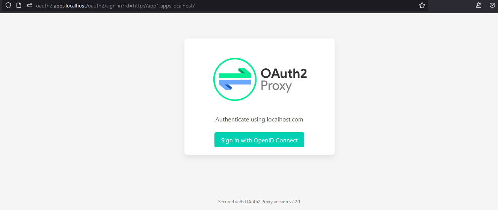

# Proxy Auth Request


This schema represents the concept and not the exact architcture in the code.
## Run

```
docker-compose up
```

## Usage

The following apps are available:

* http://app1.apps.localhost
    * Auth request authentication + internal authentication
    * Authentication at the proxy doesn't prevent internal auth if the app isn't aware of it
* http://app2.apps.localhost
    * Auth request authentication + OpenID Connect Authentication
    * User doesn't need to enter his credential again after accessing the app because the same authorization server is used.
* http://oauth2.apps.localhost
    * Auth Request server
    * Uses http://auth.apps.localhost as an authentication backend
* http://auth.apps.localhost
    * OpenID Connect authorization server
    * Discovery URL: http://auth.apps.localhost/.well-known/openid-configuration
    * Credentials: user@localhost.com/password

**Special case here**: cookies can't be set for domain `.localhost` because it does not have at least 2 dots like a real domain. Therefore all the apps will be under `.apps.localhost` in this example.

Each app is protected by a request to the auth request server.

Auth request server could be anything that can respond 20x or 40x to subrequests. Here [OAuth2-proxy](https://oauth2-proxy.github.io/oauth2-proxy/) uses an OpenID Connect authorization server to validate requests.

Since http://app2.apps.localhost is an OAuth2 client, it can use the same authorization server.

## Screenshots


