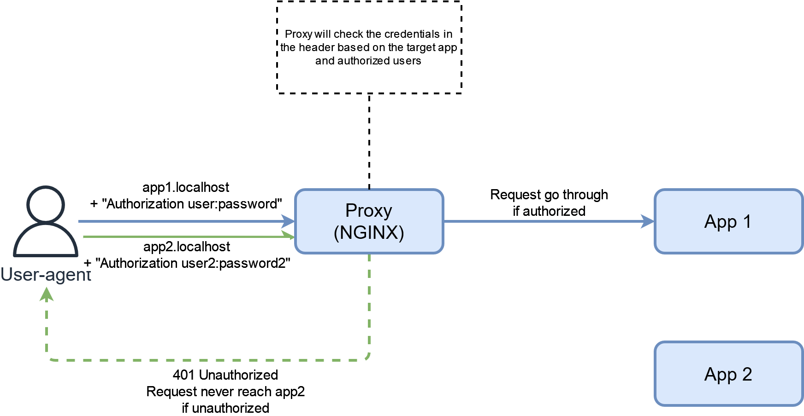
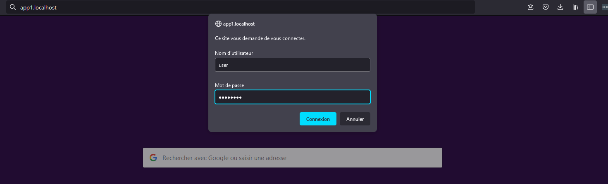

# Proxy Basic Auth



This schema represents the concept and not the exact architcture in the code.
## Run

```
docker-compose up
```

## Usage

The following apps are available:

* http://app1.localhost
    * Authentication (auth_basic) required
    * Credentials: user/password OR user2/password2
* http://app2.localhost
    * Authentication (auth_basic) required
    * Credentials: user/password OR user2/password2;

Apps that don't have internal authentication are protected with basic auth.

## Screenshots

